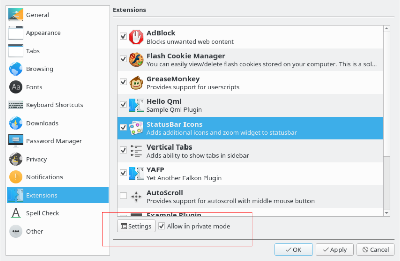

This week was mainly focused on three things

- Enable loading/unloading of QML plugins in Falkon
- Adding permission to existing plugin infrastructure for allowing plugin in incognito
- Developing QML Bookmarks API similar to WebExtension API

## Enable loading/unloading of QML plugins in Falkon
QML plugins will now be loaded into Falkon from the subdirectory qml in the standard plugin paths, similar to Python plugins. Also in metadata.desktop file for plugin, the main entry file (QML) can be specified so that the plugin named X can have the entry file Y.qml. 
## Adding permission to existing plugin infrastructure for allowing plugin in incognito
Plugins will now support permission to allow them in incognito mode. Also the information for plugins is moved from ini files to sql database.

## Developing QML Bookmarks API similar to WebExtension API
The following table demonstrates the browser compatibility of WebExtension API for Falkon compared with other browsers.

|                   |Falkon   |Chrome   |Edge    |Mozilla  |
|-------------------|---------------------------------------------|----------------------------------------------|---------------------------------------------|----------------------------------------------|
|BookmarkTreeNode   |&#10003; |&#10003;  |&#10060; |&#10003;  |
|BookmarkTreeNodeType|&#10060;*|&#10060;  |&#10060; |&#10003;  |
|BookmarkTreeNodeUnmodifiable|&#10060;*|&#10003;|&#10060;|&#10003;|
|CreateDetails|&#10060;*|&#10003;|&#10060;|&#10003;|
|create|&#10003;|&#10003;|&#10003;|&#10003;|
|get|&#10003;|&#10003;|&#10060;|&#10003;|
|getChildren|&#10003;|&#10003;|&#10060;|&#10003;|
|getRecent|&#10060;|&#10003;|&#10060;|&#10003;|
|getSubTree|&#10060;*|&#10003;|&#10060;|&#10003;|
|getTree|&#10060;*|&#10003;|&#10003;|&#10003;|
|move|&#10060;|&#10003;|&#10003;|&#10003;|
|onChange|&#10003;|&#10003;|&#10060;|&#10003;|
|onChildrenReordered|&#10060;*|&#10003;|&#10060;|&#10060;|
|onCreated|&#10003;|&#10003;|&#10060;|&#10003;|
|onImportBegan|&#10060;|&#10003;|&#10060;|&#10060;|
|onImportEnded|&#10060;|&#10003;|&#10060;|&#10060;|
|onMoved|&#10060;|&#10003;|&#10060;|&#10003;|
|onRemoved|&#10003;|&#10003;|&#10060;|&#10003;|
|remove|&#10003;|&#10003;|&#10060;|&#10003;|
|search|&#10003;|&#10003;|&#10060;|&#10003;|
|update|&#10003;|&#10003;|&#10060;|&#10003;|

To enable the support of API's marked with &#10060;*, the additional API includes:

- BookmarkTreeNode.type
- BookmarkTreeNode.parent
- Bookmarks.rootItem, Bookmarks.toolbarFolder, Bookmarks.menuFolder, Bookmarks.unsortedFolder
- Bookmarks.lastUsedFolder
- Bookmarks.isBookmarked

---

Currently I am, with a great help from my mentor David Rosca, working on developing autotests for the Bookmarks API.

Happy Summers :)
