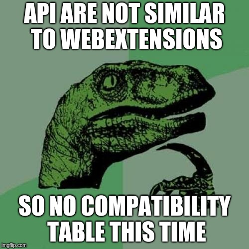

The week was totally involved in developing QML APIs which are **not** similar to WebExtension APIs. The follwoing APIs are developed:

- Clipboard API: The API to interact with Clipboard.
- Notifications API: The API to display desktop notifications.
- Tabs API: The API to interact with Tabs.

### Clipboard API
This is a very short API - just with one method copy, enabling copying to clipboard by passing a JavaScript object containg text to Falkon.Clipboard.copy.

### Notifications API
This is also a very short API - just with one method create, enabling creation of desktop notifications by passing a JavaScript object containg icon(url), heading and message of the notification to Falkon.Notifications.create.

### Tabs API
API consumed a humongous time of both me and my mentor David. This exposes the Falkon c++ methods of TabWidget class as singleton Falkon.Tabs and methods of WebTab class as uncreatable type Falkon.Tab. 

This time I am not including the WebExtension compatibility table as the APIs developed are not similar to the WebExtension APIs.
Also, I am very thankful to my mentor David Rosca for always helping me.

Happy Summers!