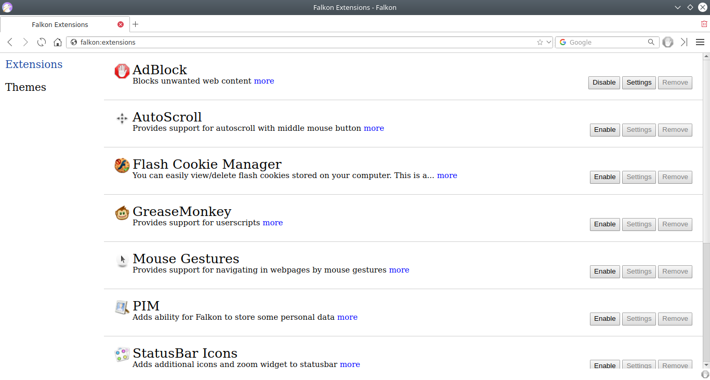
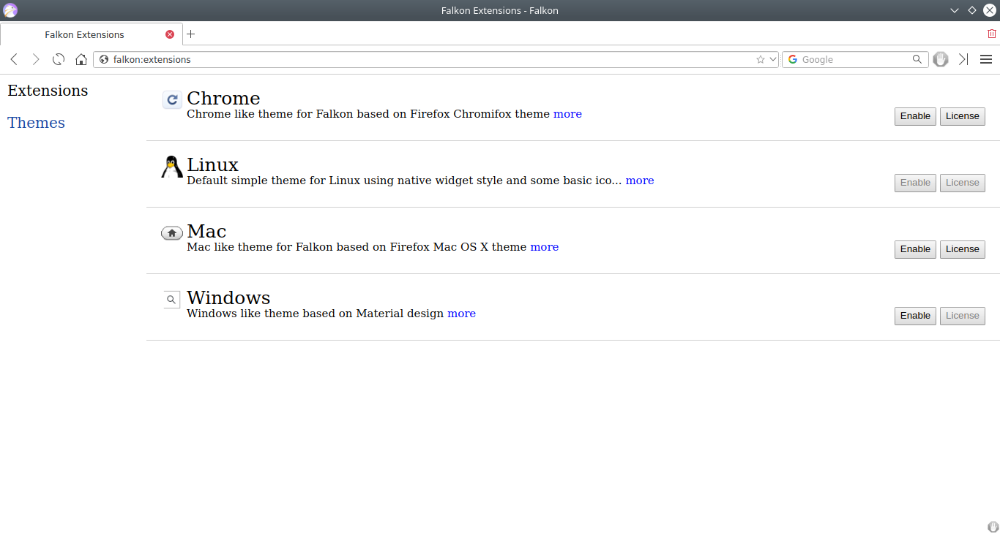

Wooo... this is the last day of coding phase of GSoC. I am writing this blog to share my experience and work done in the coding phase. I want to specially thank my mentor David Rosca for his help, suggestions and reviews. This was my first exposure to the KDE community and I am proud that it was great. I really enjoyed the whole program from proposal submission - intermediate evals - then now this final evaluation. Also, I had learned a lot working on my project. Frankly speaking, I didn't knew about i18n and l10n much but with the help of my mentor now I have a quite good understanding of how these works and are implemented. I can truly say this was one of my best summer vacations.

The code will soon be merged with the master branch of falkon. You can see my [status report](https://community.kde.org/GSoC/2018/StatusReports/AnmolGautam) page for more details about the work done during GSoC. Also in the last weeks I have implemented an extensions page for falkon similar to *about:addons* in firefox. Below is the screenshot of *falkon:extensions* page. This also enables to remove the extension from local storage. Also, the themes can be viewed and controlled by the theme panel on the same page.

And yes, I will regularly contribute to KDE community specially Falkon.

Happy August
